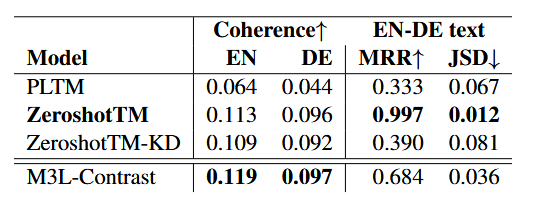
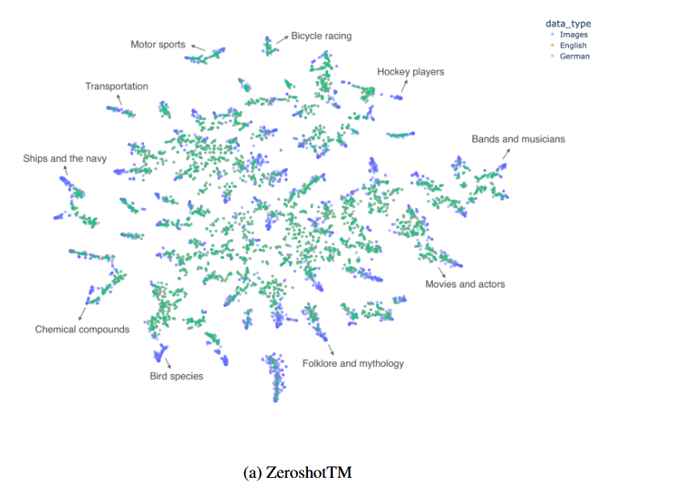
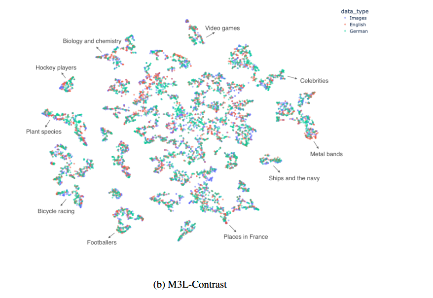

## Multilingual and Multimodal Topic Modelling with Pretrained Embeddings 2022

#### 摘要：

提出了M3L-Contrast——一种新颖的多模态多语言（M3L）神经主题模型，用于可比数据，将来自多种语言的文本和图像映射到共享的主题空间。

M3L在文本和图像上联合训练，并利用预训练的文档和图像嵌入来抽象不同语言和模态之间的复杂性。

作为一种多语言主题模型，它生成对齐的语言特定主题。

作为多模态模型，它推断图像中语义概念的文本表示。

#### Introduction

1.我们提出了一种神经多模态和多语言主题模型，用于可比数据，将图像和文本映射到共享的主题空间；

2.我们表明，对比学习在将未对齐编码器的嵌入映射到共享主题空间方面是有效的，并且改善了对齐嵌入的对齐；

3.我们提出了一种用于可比多语言数据的多语言主题模型，使用预训练嵌入，并改进了可比数据的经典主题模型。

#### Related Work

PLTM是广泛使用的经典多语言主题模型，适用于可比数据。

ZeroshotTM虽然不是多语言模型，但它能够进行零样本跨语言主题推断：如果模型在来自多语言编码器的嵌入上进行训练，它可以预测未见语言文档的主题分布。然而，ZeroshotTM需要对齐的嵌入才能进行零样本主题建模。

#### Multilingual and Multimodal Model

多语言主题模型

模型基于ZeroshotTM，为每种语言构建独立的推断网络，使用预训练的文档嵌入，这些嵌入不需要事先对齐，适应低资源环境。

对于每个对齐的多语言文档元组，使用独立的编码器（可以是对齐或不对齐的）对每种语言的文档进行编码。将文档嵌入传递到各自的推断网络，推断出高斯分布的均值（μ）和方差（σ²）。

从推断网络输出的高斯分布中采样，得到每个文档的主题分布。在此阶段，各语言是相互独立的，尚未共享任何信息。

通过最小化来自不同语言的可比文档的主题分布之间的KL散度，诱导共享主题空间。

计算语言特定分布之间的成对KL散度，以实现主题对齐。

使用InfoNCE作为对比损失，确保来自同一元组的文档在主题空间中接近，而不相关的文档则远离。对每个批次中的正样本对和负样本对进行计算，正样本对来自同一元组，负样本对来自不同元组。

总损失由三个部分组成：

1.重构损失：每种语言的词袋（BoW）重构损失总和。

2.KL散度损失：语言特定文档分布之间的KL散度总和。

3.对比损失：使用InfoNCE计算的损失。

ps:  **KL**散度是用来衡量两个概率分布之间的差异的一个重要指标.

**InfoNCE**是一种对比损失函数，用于学习嵌入空间中相似样本的相对距离。其核心思想是通过对比相似样本和不相关样本来优化模型，使得相似样本在嵌入空间中靠得更近，而不相关样本则远离。

#### Experimental Setup

Datasets:对齐的英语和德语维基百科文章及图像的数据集

Evaluation:

1.文本检索性能 ：平均倒数排名（MRR）

2.主题分布相似性：报告来自同一元组的所有数据对的主题分布的**平均JSD**，用于进一步分析不同模态和语言之间的主题一致性。

3.主题连贯性：使用**归一化点互信息**（NPMI）来计算语言特定的主题连贯性。NPMI是一种评估主题内部一致性和相关性的指标，反映了主题词之间的关系。

Baselines:

1.PLTM                            

2.ZeroshotTM

3.ZeroshotTM-KD

ZeroshotTM 主题空间，对齐文章的主题分布非常相似（大多数表示英文文章的点被德文文章的点覆盖）。然而，图像往往是孤立的，解释了为什么 ZeroshotTM 在文本-图像检索任务中表现不佳。

M3L-Contrast 诱导的主题空间中，文章和图像在主题上往往聚集在一起。没有单一的模态或语言被单独隔离开来。这解释了为什么 M3L-Contrast 在文本-图像检索中表现优于 ZeroshotTM。英文和德文文章之间的距离没有 ZeroshotTM 中那么近，也证明了联合训练考虑了所有语言的数据，并调整了不同语言之间可能存在的世界观差异，尽管这种属性导致了跨语言文本检索性能的下降。

#### 结论

M3L-Contrast是一种基于ZeroshotTM的多模态和多语言神经主题模型，利用预训练的文档和图像嵌入，在多语言文本和图像上联合训练，且不需要对齐的嵌入。该模型在多语言环境中相较于经典的PLTM有显著改进，在主题分布对齐方面与ZeroshotTM具有竞争力；在多模态环境中，M3L-Contrast在对齐文本与图像的主题空间方面表现优异，且即使使用未对齐的嵌入，仍然优于对齐嵌入的ZeroshotTM。此外，该架构易于扩展到其他模态，并在低资源环境中显示出潜在应用价值。

